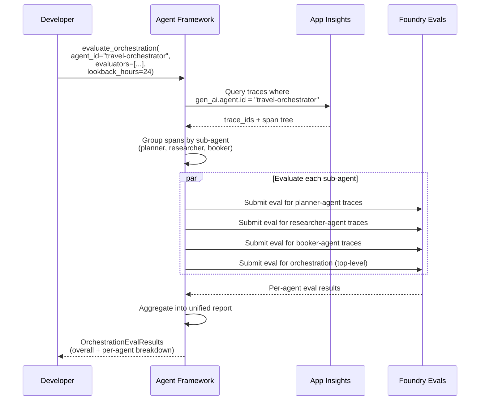

# Evaluating Sub-Agents in Hosted Orchestrations

## The Scenario

A multi-agent orchestration (Handoff, Magentic-One, etc.) is deployed as a **single Foundry Hosted Agent**. Foundry can evaluate the orchestration as a whole, but the individual sub-agents within it are invisible to Foundry.

```
┌─────────────────────────────────────────────┐
│  Foundry Hosted Agent: "travel-orchestrator" │  ← Foundry sees this
│                                              │
│  ┌──────────┐ ┌──────────┐ ┌──────────────┐ │
│  │ Planner  │ │ Booker   │ │ Researcher   │ │  ← Foundry doesn't see these
│  │ Agent    │ │ Agent    │ │ Agent        │ │
│  └──────────┘ └──────────┘ └──────────────┘ │
└─────────────────────────────────────────────┘
```

## What the traces already capture

Agent Framework's OTel instrumentation emits **nested spans** with `gen_ai.agent.id` at every level:

```
Workflow span: travel-orchestrator
├── Agent span: planner-agent     (gen_ai.agent.id = "planner-agent")
│   ├── LLM call span
│   └── Tool call span
├── Agent span: researcher-agent  (gen_ai.agent.id = "researcher-agent")
│   ├── LLM call span
│   ├── Tool call span: web_search
│   └── Tool call span: summarize
└── Agent span: booker-agent      (gen_ai.agent.id = "booker-agent")
    ├── LLM call span
    └── Tool call span: book_flight
```

## Proposed flow



## Developer experience

```python
from agent_framework.foundry import evaluate_orchestration

results = await evaluate_orchestration(
    project_endpoint=os.getenv("AZURE_AI_PROJECT"),
    orchestration_agent_id="travel-orchestrator",
    evaluators=["intent_resolution", "task_adherence", "tool_call_accuracy"],
    model_deployment="gpt-4o",
    lookback_hours=24,
)

# Overall orchestration scores
print(results.summary)
# ┌──────────────────────────────┬───────┬──────┐
# │ travel-orchestrator (overall)│ Pass  │ Avg  │
# ├──────────────────────────────┼───────┼──────┤
# │ Intent Resolution            │ 8/10  │ 4.2  │
# │ Task Adherence               │ 9/10  │ 4.5  │
# │ Tool Call Accuracy           │ 7/10  │ 3.8  │
# └──────────────────────────────┴───────┴──────┘

# Per sub-agent breakdown
for agent_name, agent_results in results.by_agent.items():
    print(f"\n{agent_name}:")
    print(f"  Intent Resolution: {agent_results.intent_resolution}")
    print(f"  Task Adherence:    {agent_results.task_adherence}")
    print(f"  Tool Call Accuracy:{agent_results.tool_call_accuracy}")

# Output:
# planner-agent:
#   Intent Resolution: 4.8 (pass)
#   Task Adherence:    4.5 (pass)
#   Tool Call Accuracy: N/A (no tools)
#
# researcher-agent:
#   Intent Resolution: 4.0 (pass)
#   Task Adherence:    4.2 (pass)
#   Tool Call Accuracy: 3.5 (pass)
#
# booker-agent:
#   Intent Resolution: 3.8 (pass)
#   Task Adherence:    4.8 (pass)
#   Tool Call Accuracy: 4.2 (pass)

# Portal links per agent
for agent_name, agent_results in results.by_agent.items():
    print(f"{agent_name}: {agent_results.report_url}")
```

## Why this matters

Without this, a developer who sees "Tool Call Accuracy: 3.8" on their orchestration has no idea which agent is dragging the score down. Is it the planner making bad tool choices? The booker passing wrong arguments? They'd have to manually dig through traces.

With `evaluate_orchestration()`, they immediately see that the researcher agent has the lowest tool call accuracy and can focus their improvement efforts there.

## Prerequisites

- OTel tracing configured to export to App Insights
- Sub-agents must have distinct `name` or `id` values (agent-framework already sets `gen_ai.agent.id` per agent)
- Foundry Evals must support evaluating trace subsets (trace IDs + span filtering) — **needs verification**

## Open question

Does Foundry's trace-based eval evaluate the entire trace, or can it be scoped to specific spans within a trace? If it evaluates the whole trace, we may need to submit sub-agent interactions as separate eval items (via the dataset/JSONL path) rather than as trace IDs. This would mean the framework needs to:
1. Query traces from App Insights
2. Extract sub-agent conversations from the span tree
3. Convert to the eval message format using `AgentEvalConverter`
4. Submit as a JSONL dataset eval

This still works — it just uses Path 3 (Dataset eval) under the hood instead of Path 1 (Traces).
