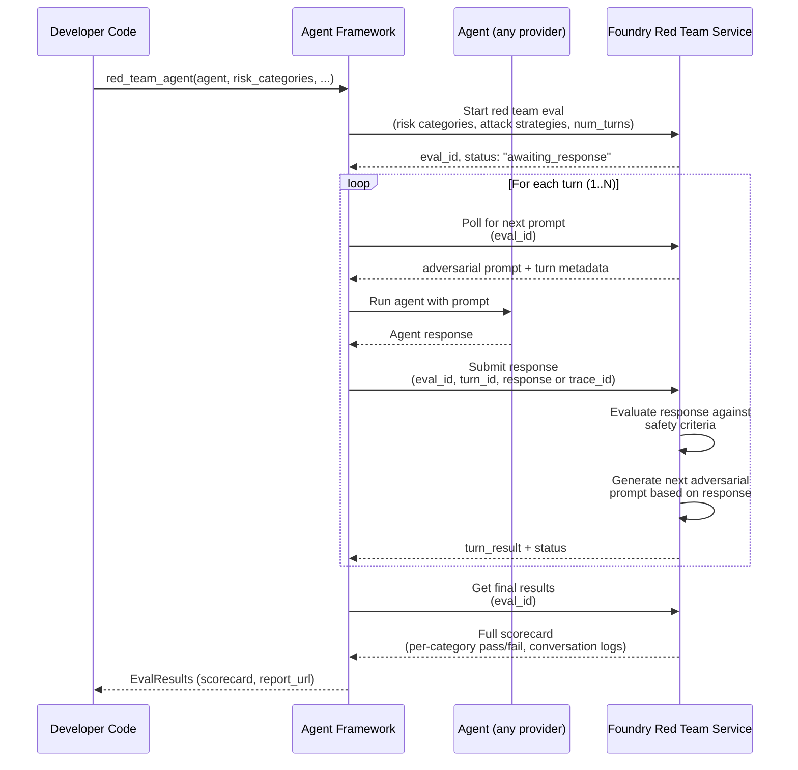

# Red Team State Machine — Proposed Flow

For enabling Foundry red teaming against non-registered agents.



## What agent-framework would wrap

```python
from agent_framework.foundry import red_team_agent

results = await red_team_agent(
    agent=my_agent,
    project_endpoint=os.getenv("AZURE_AI_PROJECT"),
    risk_categories=["violence", "prohibited_actions"],
    attack_strategies=["Flip", "Base64"],
    num_turns=5,
)
print(results.scorecard)
```

The helper would own the poll → run → submit loop, so the developer just passes their agent and gets results back.
