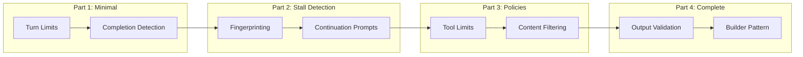
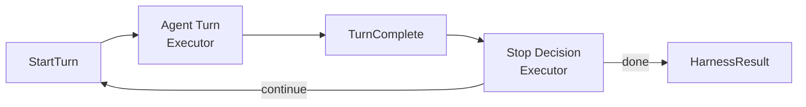

# Building a Custom Agent Harness: Introduction

*This is the introduction to a series on building custom agent harnesses using the Agent Framework's workflow system.*

## What is an Agent Harness?

When you run an LLM agent, you're essentially starting a loop: the agent receives a task, thinks, calls tools, observes results, and repeats until done. But what controls that loop? What prevents it from running forever? What happens when the agent gets stuck?

An **agent harness** is the control layer that wraps agent execution. It's responsible for:

- **Turn management** - Limiting how many iterations the agent can take
- **Completion detection** - Recognizing when the agent has finished its task
- **Stall detection** - Identifying when the agent is stuck in a loop
- **Policy enforcement** - Ensuring the agent operates within defined boundaries
- **Output validation** - Verifying the agent's output meets requirements

Think of it like a safety harness for rock climbing - it doesn't do the climbing for you, but it prevents catastrophic failures.

## Why Build Your Own?

Most agent frameworks provide a built-in run loop. So why build a custom harness?

**Control**: You decide exactly when to stop, what to check, and how to recover from problems.

**Observability**: You can emit events at every decision point, enabling rich debugging and monitoring.

**Domain-specific logic**: Your use case might need custom validation, specialized stall detection, or unique recovery strategies.

**Composability**: With a well-designed harness, you can mix and match behaviors without modifying existing code.

## What We're Building

Over this series, we'll build a production-ready agent harness piece by piece:

Each part builds on the previous, demonstrating how composable design makes complex behavior manageable.

## The Key Insight: Workflows as Harness Architecture

We'll use the Agent Framework's **workflow system** to build our harness. A workflow is a graph of **executors** - small, focused components that:

1. Receive a **trigger** (input)
2. Do some work
3. Return a **result** (which becomes the next executor's trigger)

This maps perfectly to harness concerns:

Each executor handles one concern. Want to add stall detection? Add an executor. Want policy checks? Add another executor. The workflow routes triggers between them automatically.

## Prerequisites

This series assumes you're familiar with:

- Python async/await
- Basic LLM agent concepts (prompts, tools, responses)
- The Agent Framework basics (creating agents, defining tools)

You don't need deep workflow experience - we'll explain as we go.

## Series Overview

| Part | Topic | What You'll Learn |
|------|-------|-------------------|
| **Part 1** | Minimal Harness | Workflow basics, turn limits, completion detection |
| **Part 2** | Stall Detection | Response fingerprinting, continuation prompts |
| **Part 3** | Policy Enforcement | Pluggable policies, workflow composition |
| **Part 4** | Complete Harness | Output validation, builder pattern, production patterns |

## Let's Get Started

In [Part 1](./part1_minimal/README.md), we'll build a minimal harness that prevents infinite loops and detects when the agent is done. It's simple, but it establishes the patterns we'll use throughout the series.

---

*Next: [Part 1 - A Minimal Agent Harness](./part1_minimal/README.md)*
