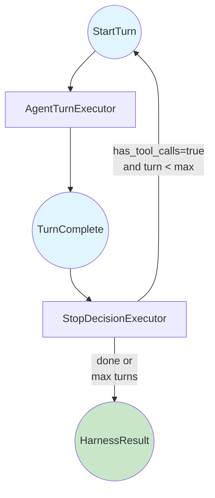
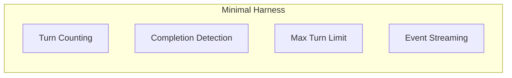

# Building a Custom Agent Harness: Part 2 - A Minimal Harness

*This is Part 2 of a series on building custom agent harnesses. [Start from Part 1](../part1_introduction.md) if you haven't already.*

## The Problem

Without a harness, an agent loop might look like this:

```python
while True:
    response = await agent.run(messages)
    if not response.tool_calls:
        break  # Hope the agent is done!
```

This has problems:
- No turn limit - a confused agent could loop forever
- No observability - you can't see what's happening
- Brittle completion detection - what if the agent says "I'll do X" but doesn't?

Let's fix this with a proper harness.

## The Design

Our minimal harness uses two **executors** in a loop:



**AgentTurnExecutor**: Runs one agent turn (LLM call + tool execution), emits a `TurnComplete` trigger.

**StopDecisionExecutor**: Decides whether to continue or stop. Returns either `StartTurn` (loop back) or `HarnessResult` (we're done).

## Shared State

Executors communicate through **shared state** in the workflow context. We define keys for our state:

```python
TURN_COUNT_KEY = "harness:turn_count"
MAX_TURNS_KEY = "harness:max_turns"
AGENT_MESSAGES_KEY = "harness:messages"
```

This is the "contract" between executors. Any executor can read or write these values.

## The Trigger Types

Triggers are dataclasses that flow between executors:

```python
@dataclass
class StartTurn:
    """Trigger to start an agent turn."""
    pass

@dataclass
class TurnComplete:
    """Result of an agent turn."""
    response_text: str
    has_tool_calls: bool
```

The workflow routes triggers to the right executor based on type.

## AgentTurnExecutor

This executor runs one turn:

```python
class AgentTurnExecutor(Executor):
    def __init__(self, agent: AgentProtocol):
        super().__init__()
        self._agent = agent
        self._thread = agent.get_new_thread()

    async def execute(
        self, trigger: StartTurn, ctx: WorkflowContext[Any]
    ) -> TurnComplete:
        # Get conversation from shared state
        messages = await ctx.get_shared_state(AGENT_MESSAGES_KEY)

        # Track turns
        turn_count = await ctx.get_shared_state(TURN_COUNT_KEY)
        turn_count += 1
        await ctx.set_shared_state(TURN_COUNT_KEY, turn_count)

        # Call the agent
        response = await self._agent.run(messages, thread=self._thread)

        # Update conversation history
        messages.append(ChatMessage(role="assistant", text=response.text))
        await ctx.set_shared_state(AGENT_MESSAGES_KEY, messages)

        # Emit event for observability
        await ctx.add_event(
            WorkflowEvent(data={"turn": turn_count, "response": response.text[:200]})
        )

        return TurnComplete(
            response_text=response.text or "",
            has_tool_calls=bool(response.tool_calls),
        )
```

Key points:
- Reads/writes shared state for conversation and turn count
- Emits events so external observers can track progress
- Returns `TurnComplete` which routes to `StopDecisionExecutor`

## StopDecisionExecutor

This executor makes the stop/continue decision:

```python
class StopDecisionExecutor(Executor):
    async def execute(
        self, trigger: TurnComplete, ctx: WorkflowContext[Any]
    ) -> StartTurn | HarnessResult:
        turn_count = await ctx.get_shared_state(TURN_COUNT_KEY)
        max_turns = await ctx.get_shared_state(MAX_TURNS_KEY)

        # Agent is done when it stops calling tools
        agent_done = not trigger.has_tool_calls

        if agent_done:
            await ctx.yield_output(
                HarnessResult(
                    status=HarnessStatus.COMPLETE,
                    turn_count=turn_count,
                    final_response=trigger.response_text,
                )
            )
            return None  # End workflow

        if turn_count >= max_turns:
            await ctx.yield_output(
                HarnessResult(
                    status=HarnessStatus.MAX_TURNS,
                    turn_count=turn_count,
                    final_response=trigger.response_text,
                )
            )
            return None  # End workflow

        # Continue to next turn
        return StartTurn()
```

The return type is a union: `StartTurn | HarnessResult`. Returning `StartTurn` loops back to the agent executor. Returning `None` (after yielding output) ends the workflow.

## Wiring It Together

The workflow builder connects executors to their trigger types:

```python
def build_harness_workflow(agent: AgentProtocol) -> Workflow:
    agent_executor = AgentTurnExecutor(agent)
    stop_executor = StopDecisionExecutor()

    return (
        Workflow(name="minimal-harness")
        .add_executor(agent_executor, trigger_type=StartTurn)
        .add_executor(stop_executor, trigger_type=TurnComplete)
    )
```

That's it. The workflow automatically routes:
- `StartTurn` → `AgentTurnExecutor`
- `TurnComplete` → `StopDecisionExecutor`

## The SimpleHarness Class

We wrap everything in a clean interface:

```python
class SimpleHarness:
    def __init__(self, agent: AgentProtocol, max_turns: int = 10):
        self._workflow = build_harness_workflow(agent)
        self._max_turns = max_turns

    async def run(self, task: str) -> HarnessResult:
        initial_state = {
            TURN_COUNT_KEY: 0,
            MAX_TURNS_KEY: self._max_turns,
            AGENT_MESSAGES_KEY: [ChatMessage(role="user", text=task)],
        }

        async for event in self._workflow.run_stream(StartTurn(), **initial_state):
            if isinstance(event.data, HarnessResult):
                return event.data

        return HarnessResult(status=HarnessStatus.ERROR, turn_count=0)
```

Usage is simple:

```python
harness = SimpleHarness(agent, max_turns=10)
result = await harness.run("What time is it?")
print(f"Status: {result.status}, Turns: {result.turn_count}")
```

## Running the Example

```bash
cd python/samples/blog_harness/part2_minimal
python example.py
python example.py --max-turns 5
python example.py --task "Calculate sqrt(144) + sqrt(256)"
```

## What We've Built



This minimal harness gives us:
- **Turn counting** - Know exactly how many iterations occurred
- **Completion detection** - Stop when the agent finishes (no tool calls)
- **Max turn limit** - Prevent infinite loops
- **Event streaming** - Observe execution in real-time

## What's Missing?

Our completion detection is naive: "no tool calls = done". But what if the agent:
- Says "I'll check that for you" but doesn't call any tools?
- Keeps repeating the same response?
- Gets stuck in a reasoning loop?

In [Part 3](../part3_stall_detection/README.md), we'll add **stall detection** to catch these cases.

---

*Previous: [Part 1 - Introduction](../part1_introduction.md)*
*Next: [Part 3 - Stall Detection](../part3_stall_detection/README.md)*
