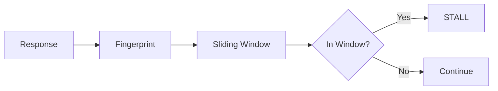
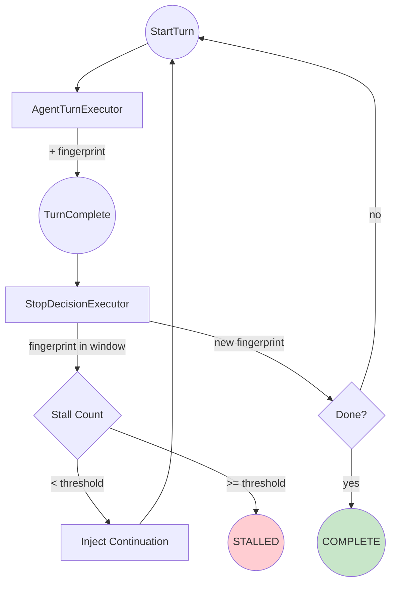
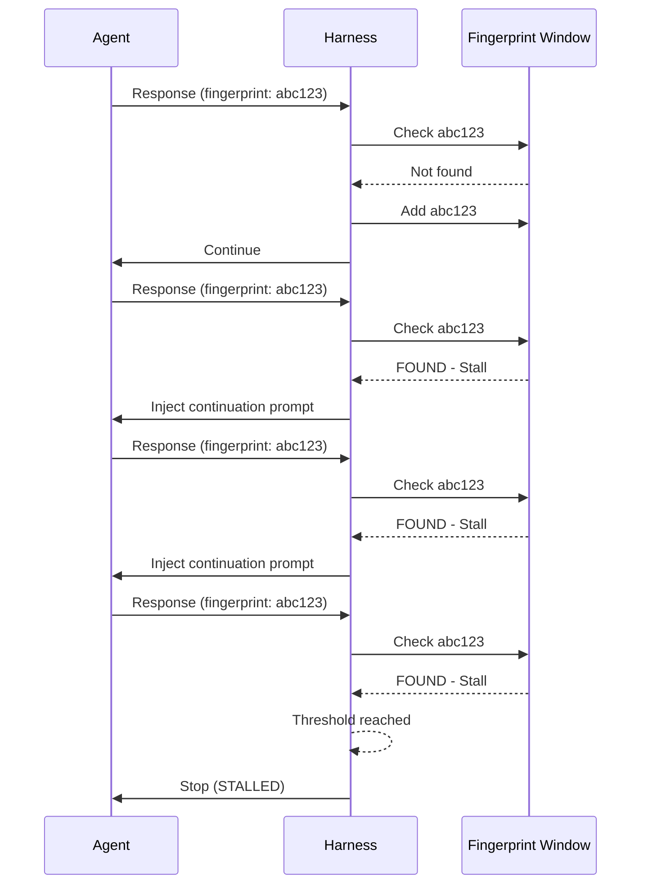

# Building a Custom Agent Harness: Part 3 - Stall Detection

*This is Part 3 of a series on building custom agent harnesses. [Start from Part 1](../part1_introduction.md) if you haven't already.*

## The Problem

In Part 2, we built a harness that stops when the agent finishes (no tool calls) or hits a turn limit. But agents can get stuck in subtler ways:

- **Repetitive responses**: "I'll look that up for you" → calls tool → "I'll look that up for you" → ...
- **Reasoning loops**: The agent keeps restating the problem without making progress
- **Retry storms**: Calling a failing tool over and over

These stalls waste tokens and time. We need to detect them.

## The Solution: Response Fingerprinting

Instead of comparing exact responses (which vary slightly), we'll **fingerprint** each response - capturing its "shape" rather than exact content.



If a fingerprint appears in our recent history, we've seen this response pattern before - that's a stall.

## Computing Fingerprints

Our fingerprint captures response characteristics:

```python
def compute_fingerprint(response_text: str, has_tool_calls: bool) -> str:
    # Normalize whitespace
    normalized = " ".join(response_text.split())

    # Extract features
    prefix = normalized[:200]  # Captures intent/structure
    suffix = normalized[-100:]  # Captures conclusion
    length_bucket = "short" if len(normalized) < 100 else \
                    "medium" if len(normalized) < 500 else "long"

    # Combine into fingerprint
    fingerprint_input = f"{prefix}|{suffix}|{has_tool_calls}|{length_bucket}"

    # Hash it
    return hashlib.md5(fingerprint_input.encode()).hexdigest()[:12]
```

This catches responses that are "shaped" the same even if wording varies slightly.

## Updated Workflow

We add stall detection to our workflow:



When we detect a stall:
1. Increment stall counter
2. If under threshold, inject a **continuation prompt** to break the loop
3. If over threshold, stop with `STALLED` status

## The Continuation Prompt

When a stall is detected, we inject a message to nudge the agent:

```python
CONTINUATION_PROMPT = (
    "You seem to be repeating yourself or stuck in a loop. "
    "Please take a different approach or make concrete progress. "
    "If you've completed the task, say so clearly. "
    "If you're blocked, explain what's preventing progress."
)
```

This often breaks the loop by making the agent reconsider its approach.

## Updated StopDecisionExecutor

The executor now tracks fingerprints and handles stalls:

```python
class StopDecisionExecutor(Executor):
    async def execute(
        self, trigger: TurnComplete, ctx: WorkflowContext[Any]
    ) -> StartTurn | HarnessResult:
        # ... get shared state ...

        # Check for stall
        recent_fingerprints = await ctx.get_shared_state(RECENT_FINGERPRINTS_KEY)
        is_stall = trigger.fingerprint in recent_fingerprints

        if is_stall:
            stall_count += 1
            await ctx.set_shared_state(STALL_COUNT_KEY, stall_count)

            # Emit event for observability
            await ctx.add_event(WorkflowEvent(data={
                "event": "stall_detected",
                "stall_count": stall_count,
            }))

            if stall_count >= stall_threshold:
                # Give up
                await ctx.yield_output(HarnessResult(
                    status=HarnessStatus.STALLED,
                    turn_count=turn_count,
                    stall_count=stall_count,
                ))
                return None

            # Inject continuation prompt
            messages = await ctx.get_shared_state(AGENT_MESSAGES_KEY)
            messages.append(ChatMessage(role="user", text=self.CONTINUATION_PROMPT))
            await ctx.set_shared_state(AGENT_MESSAGES_KEY, messages)

            return StartTurn()  # Try again

        # Not a stall - update fingerprint window
        recent_fingerprints.append(trigger.fingerprint)
        if len(recent_fingerprints) > 5:  # Sliding window of 5
            recent_fingerprints = recent_fingerprints[-5:]
        await ctx.set_shared_state(RECENT_FINGERPRINTS_KEY, recent_fingerprints)

        # ... rest of completion logic ...
```

## New Shared State

We add keys for stall tracking:

```python
STALL_THRESHOLD_KEY = "harness:stall_threshold"
STALL_COUNT_KEY = "harness:stall_count"
RECENT_FINGERPRINTS_KEY = "harness:recent_fingerprints"
CONTINUATION_INJECTED_KEY = "harness:continuation_injected"
```

## Testing Stall Detection

The example includes a stall-inducing scenario:

```python
# A tool that always fails
@ai_function
def unreliable_api(query: str) -> str:
    return "Error: Service temporarily unavailable. Please try again later."

# A task that triggers stalls
STALL_TASK = """
Use the unreliable_api tool to look up the weather.
Keep trying until you get a result.
"""
```

Run it:

```bash
python example.py --stall-test --stall-threshold 2
```

You'll see the harness detect repeated responses and inject continuation prompts.

## The Stall Detection Flow



## What We've Added

| Feature | Benefit |
|---------|---------|
| Response fingerprinting | Detect similar responses without exact matching |
| Sliding window | Only track recent history (memory bounded) |
| Stall counter | Tolerate occasional repeats before acting |
| Continuation prompts | Give agent a chance to recover |
| STALLED status | Clear signal when agent can't make progress |

## What's Next?

Our harness now handles turn limits and stalls. But what about:
- Limiting tool usage?
- Filtering prohibited content?
- Enforcing custom rules?

In [Part 4](../part4_policies/README.md), we'll add **pluggable policies** - and see how the workflow architecture makes this trivial.

---

*Previous: [Part 2 - Minimal Harness](../part2_minimal/README.md)*
*Next: [Part 4 - Policy Enforcement](../part4_policies/README.md)*
