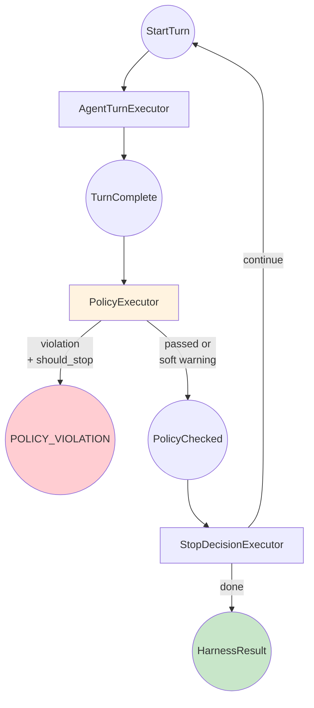
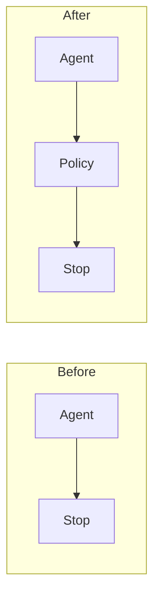

# Building a Custom Agent Harness: Part 4 - Policy Enforcement

*This is Part 4 of a series on building custom agent harnesses. [Start from Part 1](../part1_introduction.md) if you haven't already.*

## The Problem

Our harness handles turn limits and stalls. But in production, you often need additional controls:

- **Limit tool usage** - Prevent runaway API calls that cost money
- **Filter content** - Block responses containing sensitive patterns
- **Enforce length limits** - Ensure responses aren't too short or too long
- **Custom rules** - Domain-specific constraints

We could add these checks to `StopDecisionExecutor`, but that would violate single-responsibility and make the code harder to maintain.

## The Solution: Pluggable Policies

We'll create a **policy system** with:
1. A `Policy` base class defining the interface
2. Built-in policies for common needs
3. A `PolicyExecutor` that runs policies after each turn

The key insight: **we can insert a new executor into the workflow without modifying existing ones**.

## Updated Workflow



The `PolicyExecutor` sits between `AgentTurnExecutor` and `StopDecisionExecutor`. It receives `TurnComplete`, runs all policies, and emits either:
- `PolicyChecked` (continue to stop decision)
- `HarnessResult` with `POLICY_VIOLATION` status (hard stop)

## The Policy Interface

```python
@dataclass
class PolicyResult:
    passed: bool
    message: str | None = None
    should_stop: bool = False  # Hard stop vs. warning

class Policy(ABC):
    @property
    @abstractmethod
    def name(self) -> str:
        """Human-readable name."""
        ...

    @abstractmethod
    async def check(
        self,
        response_text: str,
        tool_call_count: int,
        ctx: WorkflowContext[Any],
    ) -> PolicyResult:
        """Check if the response violates this policy."""
        ...
```

Policies return `PolicyResult`:
- `passed=True` - All good
- `passed=False, should_stop=False` - Warning only, continue
- `passed=False, should_stop=True` - Hard stop immediately

## Built-in Policies

### MaxToolCallsPolicy

Limits total tool calls across all turns:

```python
class MaxToolCallsPolicy(Policy):
    def __init__(self, max_calls: int = 50):
        self._max_calls = max_calls

    @property
    def name(self) -> str:
        return f"MaxToolCalls({self._max_calls})"

    async def check(self, response_text, tool_call_count, ctx) -> PolicyResult:
        total = await ctx.get_shared_state(TOOL_CALL_COUNT_KEY)
        total += tool_call_count
        await ctx.set_shared_state(TOOL_CALL_COUNT_KEY, total)

        if total > self._max_calls:
            return PolicyResult(
                passed=False,
                message=f"Exceeded max tool calls ({total}/{self._max_calls})",
                should_stop=True,
            )
        return PolicyResult(passed=True)
```

### ContentFilterPolicy

Blocks responses matching prohibited patterns:

```python
class ContentFilterPolicy(Policy):
    def __init__(
        self,
        patterns: list[str],
        case_sensitive: bool = False,
        stop_on_match: bool = False,
    ):
        flags = 0 if case_sensitive else re.IGNORECASE
        self._patterns = [(p, re.compile(p, flags)) for p in patterns]
        self._stop_on_match = stop_on_match

    async def check(self, response_text, tool_call_count, ctx) -> PolicyResult:
        for pattern_str, pattern in self._patterns:
            if pattern.search(response_text):
                return PolicyResult(
                    passed=False,
                    message=f"Matched prohibited pattern: {pattern_str}",
                    should_stop=self._stop_on_match,
                )
        return PolicyResult(passed=True)
```

### ResponseLengthPolicy

Enforces response length bounds:

```python
class ResponseLengthPolicy(Policy):
    def __init__(self, min_length: int = 0, max_length: int = 10000):
        self._min_length = min_length
        self._max_length = max_length

    async def check(self, response_text, tool_call_count, ctx) -> PolicyResult:
        length = len(response_text)

        if length < self._min_length:
            return PolicyResult(
                passed=False,
                message=f"Response too short ({length} < {self._min_length})",
                should_stop=False,  # Don't stop, let agent try again
            )

        if length > self._max_length:
            return PolicyResult(
                passed=False,
                message=f"Response too long ({length} > {self._max_length})",
                should_stop=False,
            )

        return PolicyResult(passed=True)
```

## The PolicyExecutor

This executor runs all policies:

```python
class PolicyExecutor(Executor):
    def __init__(self, policies: list[Policy]):
        super().__init__()
        self._policies = policies

    async def execute(
        self, trigger: TurnComplete, ctx: WorkflowContext[Any]
    ) -> PolicyChecked | HarnessResult:
        violations = await ctx.get_shared_state(POLICY_VIOLATIONS_KEY)

        for policy in self._policies:
            result = await policy.check(
                trigger.response_text,
                trigger.tool_call_count,
                ctx,
            )

            if not result.passed:
                violations.append(f"[{policy.name}] {result.message}")
                await ctx.set_shared_state(POLICY_VIOLATIONS_KEY, violations)

                # Emit event
                await ctx.add_event(WorkflowEvent(data={
                    "event": "policy_violation",
                    "policy": policy.name,
                    "should_stop": result.should_stop,
                }))

                if result.should_stop:
                    await ctx.yield_output(HarnessResult(
                        status=HarnessStatus.POLICY_VIOLATION,
                        turn_count=await ctx.get_shared_state(TURN_COUNT_KEY),
                        policy_violations=violations,
                    ))
                    return None  # Hard stop

        # All policies passed (or only soft failures)
        return PolicyChecked(
            response_text=trigger.response_text,
            has_tool_calls=trigger.has_tool_calls,
            fingerprint=trigger.fingerprint,
            policy_passed=len(violations) == 0,
        )
```

## Wiring Policies into the Workflow

We add the executor between agent and stop decision:

```python
def build_harness_workflow(agent, policies=None):
    agent_executor = AgentTurnExecutor(agent)
    policy_executor = PolicyExecutor(policies or [])
    stop_executor = StopDecisionExecutor()

    return (
        Workflow(name="policy-harness")
        .add_executor(agent_executor, trigger_type=StartTurn)
        .add_executor(policy_executor, trigger_type=TurnComplete)
        .add_executor(stop_executor, trigger_type=PolicyChecked)
    )
```

Note how `StopDecisionExecutor` now takes `PolicyChecked` instead of `TurnComplete`. The workflow routes automatically.

## Using Policies

```python
harness = SimpleHarness(
    agent,
    max_turns=10,
    policies=[
        MaxToolCallsPolicy(max_calls=20),
        ContentFilterPolicy(
            patterns=[r"password", r"secret", r"api[_-]?key"],
            stop_on_match=True,
        ),
        ResponseLengthPolicy(min_length=10, max_length=5000),
    ],
)

result = await harness.run("Analyze this data")

if result.status == HarnessStatus.POLICY_VIOLATION:
    print(f"Stopped due to: {result.policy_violations}")
```

## Testing Policy Enforcement

```bash
# Normal task with policies
python example.py

# Trigger tool limit (agent tries to fetch lots of data)
python example.py --tool-limit-test --max-tool-calls 5

# Trigger content filter
python example.py --content-test
```

## The Power of Composition

Notice what we **didn't** do:
- We didn't modify `AgentTurnExecutor`
- We didn't modify `StopDecisionExecutor`
- We didn't create a monolithic executor

We just added a new executor to the chain. This is the power of the workflow architecture:



Each executor handles one concern. Adding behavior = adding an executor.

## Creating Custom Policies

Need a custom policy? Just implement the interface:

```python
class MyCustomPolicy(Policy):
    @property
    def name(self) -> str:
        return "MyCustomPolicy"

    async def check(self, response_text, tool_call_count, ctx) -> PolicyResult:
        # Your custom logic here
        if "forbidden" in response_text.lower():
            return PolicyResult(
                passed=False,
                message="Found forbidden content",
                should_stop=True,
            )
        return PolicyResult(passed=True)
```

## What We've Added

| Component | Purpose |
|-----------|---------|
| `Policy` base class | Interface for custom policies |
| `PolicyExecutor` | Runs policies after each turn |
| `MaxToolCallsPolicy` | Limit total tool usage |
| `ContentFilterPolicy` | Block prohibited patterns |
| `ResponseLengthPolicy` | Enforce length bounds |
| `POLICY_VIOLATION` status | Clear signal when policy stops execution |

## What's Next?

We now have a robust harness with turn limits, stall detection, and policies. In [Part 5](../part5_complete/README.md), we'll add the finishing touches:

- **Output validation** - Ensure responses meet domain requirements
- **Builder pattern** - Clean configuration API
- **Comprehensive events** - Production-ready observability

---

*Previous: [Part 3 - Stall Detection](../part3_stall_detection/README.md)*
*Next: [Part 5 - Complete Harness](../part5_complete/README.md)*
