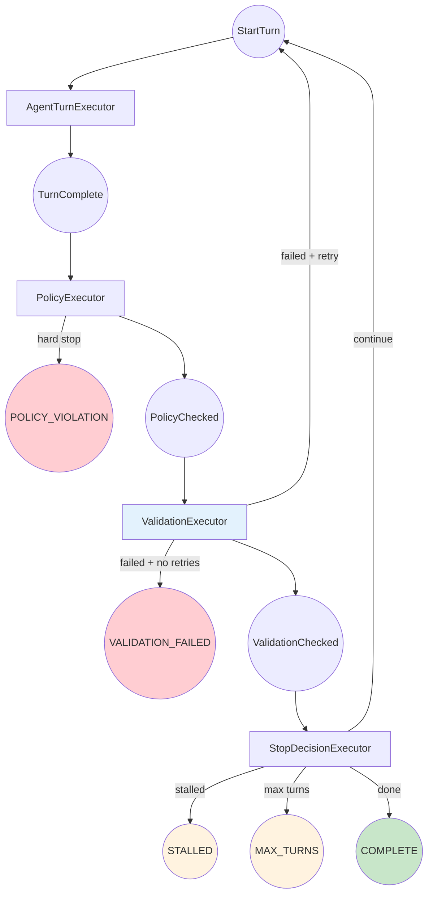
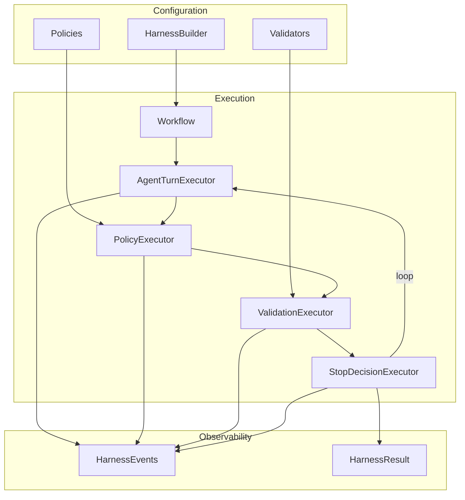

# Building a Custom Agent Harness: Part 5 - The Complete Harness

*This is Part 5 of a series on building custom agent harnesses. [Start from Part 1](../part1_introduction.md) if you haven't already.*

## What We've Built

Over this series, we've progressively built a harness with:
- Turn limits and completion detection (Part 2)
- Stall detection with fingerprinting (Part 3)
- Pluggable policy enforcement (Part 4)

In this final part, we'll add output validation and polish the API for production use.

## The Final Workflow



Four executors, each handling one concern:
1. **AgentTurnExecutor** - Run the agent
2. **PolicyExecutor** - Enforce policies
3. **ValidationExecutor** - Validate output (new!)
4. **StopDecisionExecutor** - Continue/stop decision

## Output Validation

Unlike policies (which are about safety limits), **validators** check that output meets domain requirements:

```python
class OutputValidator(ABC):
    @property
    @abstractmethod
    def name(self) -> str:
        ...

    @abstractmethod
    async def validate(
        self,
        response_text: str,
        ctx: WorkflowContext[Any],
    ) -> tuple[bool, list[str]]:
        """Returns (is_valid, list of error messages)."""
        ...
```

### JsonSchemaValidator

For when you need structured JSON output:

```python
class JsonSchemaValidator(OutputValidator):
    def __init__(
        self,
        required_fields: list[str] | None = None,
        field_types: dict[str, type] | None = None,
    ):
        self._required_fields = required_fields or []
        self._field_types = field_types or {}

    async def validate(self, response_text, ctx) -> tuple[bool, list[str]]:
        errors = []

        # Extract JSON from markdown code block or raw response
        json_match = re.search(r"```json\s*(.*?)\s*```", response_text, re.DOTALL)
        json_str = json_match.group(1) if json_match else response_text

        try:
            data = json.loads(json_str)
        except json.JSONDecodeError as e:
            return False, [f"Invalid JSON: {e}"]

        # Check required fields
        for field in self._required_fields:
            if field not in data:
                errors.append(f"Missing required field: {field}")

        # Check types
        for field, expected_type in self._field_types.items():
            if field in data and not isinstance(data[field], expected_type):
                errors.append(f"Field '{field}' has wrong type")

        return len(errors) == 0, errors
```

### CustomValidator

For quick one-off validations:

```python
class CustomValidator(OutputValidator):
    def __init__(self, name: str, validate_fn: Callable[[str], tuple[bool, list[str]]]):
        self._name = name
        self._validate_fn = validate_fn

    async def validate(self, response_text, ctx):
        return self._validate_fn(response_text)

# Usage
validator = CustomValidator(
    "HasFindings",
    lambda text: (True, []) if "findings" in text.lower() else (False, ["Missing findings"])
)
```

## ValidationExecutor

This executor validates output and retries on failure:

```python
class ValidationExecutor(Executor):
    def __init__(self, validators: list[OutputValidator], max_retries: int = 2):
        self._validators = validators
        self._max_retries = max_retries
        self._retry_counts: dict[str, int] = {}

    async def execute(self, trigger: PolicyChecked, ctx) -> ValidationChecked | StartTurn | HarnessResult:
        # Only validate when agent appears done (no tool calls)
        if trigger.has_tool_calls:
            return ValidationChecked(...)  # Pass through

        # Run all validators
        all_errors = []
        for validator in self._validators:
            is_valid, errors = await validator.validate(trigger.response_text, ctx)
            if not is_valid:
                all_errors.extend([f"[{validator.name}] {e}" for e in errors])

        if all_errors:
            turn = await ctx.get_shared_state(TURN_COUNT_KEY)
            retries = self._retry_counts.get(f"retry_{turn}", 0)

            if retries >= self._max_retries:
                # Give up
                await ctx.yield_output(HarnessResult(
                    status=HarnessStatus.VALIDATION_FAILED,
                    validation_errors=all_errors,
                ))
                return None

            # Inject correction prompt and retry
            self._retry_counts[f"retry_{turn}"] = retries + 1
            correction = (
                "Your response has validation errors:\n"
                + "\n".join(f"- {e}" for e in all_errors)
                + "\n\nPlease fix these issues and try again."
            )
            messages = await ctx.get_shared_state(AGENT_MESSAGES_KEY)
            messages.append(ChatMessage(role="user", text=correction))

            return StartTurn()  # Retry

        return ValidationChecked(...)  # Passed
```

Key feature: validators only run when the agent appears done (no tool calls). This prevents validating intermediate responses.

## The HarnessBuilder

For clean configuration, we use the builder pattern:

```python
class HarnessBuilder:
    def __init__(self, agent: AgentProtocol):
        self._agent = agent
        self._max_turns = 10
        self._stall_threshold = 3
        self._policies: list[Policy] = []
        self._validators: list[OutputValidator] = []
        self._validation_retries = 2

    def with_max_turns(self, n: int) -> "HarnessBuilder":
        self._max_turns = n
        return self

    def with_stall_detection(self, threshold: int = 3) -> "HarnessBuilder":
        self._stall_threshold = threshold
        return self

    def with_policy(self, policy: Policy) -> "HarnessBuilder":
        self._policies.append(policy)
        return self

    def with_validator(self, validator: OutputValidator) -> "HarnessBuilder":
        self._validators.append(validator)
        return self

    def build(self) -> "CompleteHarness":
        return CompleteHarness(
            agent=self._agent,
            max_turns=self._max_turns,
            stall_threshold=self._stall_threshold,
            policies=self._policies,
            validators=self._validators,
        )
```

Usage:

```python
harness = (
    HarnessBuilder(agent)
    .with_max_turns(15)
    .with_stall_detection(threshold=3)
    .with_policy(MaxToolCallsPolicy(max_calls=30))
    .with_policy(ContentFilterPolicy(patterns=["password"]))
    .with_validator(JsonSchemaValidator(required_fields=["result", "summary"]))
    .with_validation_retries(2)
    .build()
)
```

## Structured Events

For production observability, we use typed events:

```python
@dataclass
class HarnessEvent:
    event_type: str  # "turn_started", "turn_complete", "policy_violation", etc.
    turn: int = 0
    data: dict[str, Any] = field(default_factory=dict)
```

Events are emitted at every decision point, enabling:
- Real-time progress tracking
- Debugging stuck agents
- Metrics and monitoring
- UI updates

```python
async for event in harness.run_stream(task):
    if isinstance(event.data, HarnessEvent):
        if event.data.event_type == "turn_complete":
            print(f"Turn {event.data.turn}: {event.data.data['response_preview']}")
        elif event.data.event_type == "validation_failed":
            print(f"Validation errors: {event.data.data['errors']}")
```

## Real-World Example

The example demonstrates a data analysis agent that must produce structured JSON:

```python
# Task requiring structured output
TASK = """
Analyze the 'sales' dataset and produce a JSON report with:
{
    "report_title": "string",
    "findings": [{"category": "...", "insight": "...", "importance": "high|medium|low"}],
    "recommendations": ["string"],
    "summary": "string"
}
"""

# Configure harness
harness = (
    HarnessBuilder(agent)
    .with_max_turns(15)
    .with_policy(MaxToolCallsPolicy(max_calls=25))
    .with_validator(JsonSchemaValidator(
        required_fields=["report_title", "findings", "summary"],
        field_types={"findings": list, "summary": str},
    ))
    .with_validator(CustomValidator("HasFindings", validate_has_findings))
    .build()
)

result = await harness.run(TASK)
```

If the agent produces invalid JSON or misses required fields, the harness automatically:
1. Tells the agent what's wrong
2. Gives it another chance
3. Only stops after `max_retries` failures

## Running the Example

```bash
cd python/samples/blog_harness/part5_complete

# Normal analysis task
python example.py

# Show all harness events
python example.py --show-events

# Trigger validation retry
python example.py --validation-test
```

## The Complete Picture



## Summary: What We Built

| Part | Feature | Benefit |
|------|---------|---------|
| 2 | Turn limits | Prevent infinite loops |
| 2 | Completion detection | Know when agent is done |
| 3 | Fingerprinting | Detect repetitive responses |
| 3 | Continuation prompts | Break stall loops |
| 4 | Policy system | Enforce rules without code changes |
| 4 | Content filtering | Block unwanted content |
| 5 | Output validation | Ensure output meets requirements |
| 5 | Retry logic | Give agent chances to fix errors |
| 5 | Builder pattern | Clean configuration API |
| 5 | Structured events | Production observability |

## Key Takeaways

1. **Workflows enable composition** - Each executor handles one concern. Adding features = adding executors.

2. **Shared state is the contract** - Executors communicate through well-defined state keys, not tight coupling.

3. **Triggers route automatically** - Return the right type, the workflow handles routing.

4. **Events enable observability** - Emit events at decision points for debugging and monitoring.

5. **It's not magic** - A harness is just a structured loop with clear decision points. You can build exactly what you need.

## What's Next?

This harness is production-ready for many use cases. To extend it further, consider:

- **Checkpointing** - Save state for long-running tasks
- **Parallel tool execution** - Run independent tools concurrently
- **Human-in-the-loop** - Pause for approval at key points
- **Cost tracking** - Monitor token usage and API costs

The workflow architecture makes all of these additions straightforward.

---

*Previous: [Part 4 - Policy Enforcement](../part4_policies/README.md)*
*Back to: [Part 1 - Introduction](../part1_introduction.md)*
